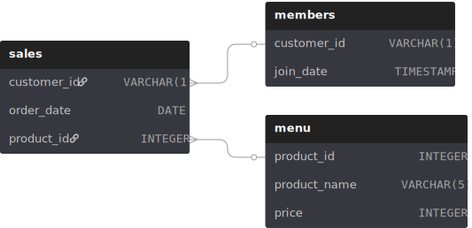

# Case Study #1 - Danny's Diner

[View original case study →](https://8weeksqlchallenge.com/case-study-1/)

## Problem
Danny's Diner needs to understand customer behavior to optimize their loyalty program. This analysis examines visiting patterns, spending habits, and menu preferences to provide data-driven recommendations.

## Solutions
✅ **[View my complete solutions and analysis →](./solutions.md)**

## Dataset Used
Three key datasets for this case study are :

- `sales` - Customer purchases with order dates and product IDs
- `menu` - Product names and prices  
- `members` - Customers and membership join dates

## Entity Relationship Diagram

## Case Study Questions

1. What is the total amount each customer spent at the restaurant?
2. How many days has each customer visited the restaurant?
3. What was the first item from the menu purchased by each customer?
4. What is the most purchased item on the menu and how many times was it purchased by all customers?
5. Which item was the most popular for each customer?
6. Which item was purchased first by the customer after they became a member?
7. Which item was purchased just before the customer became a member?
8. What is the total items and amount spent for each member before they became a member?
9. If each $1 spent equates to 10 points and sushi has a 2x points multiplier - how many points would each customer have?
10. In the first week after a customer joins the program (including their join date) they earn 2x points on all items, not just sushi - how many points do customer A and B have at the end of January?

**Bonus Questions:**
- Join All The Things
- Rank All The Things

## Relevant Links
- [Entity Relationship Diagram - dbdiagram](https://dbdiagram.io/d/608d07e4b29a09603d12edbd?utm_source=dbdiagram_embed&utm_medium=bottom_open)

- [Case Study 1 SQL Editor - DB Fiddle](https://www.db-fiddle.com/f/2rM8RAnq7h5LLDTzZiRWcd/138)